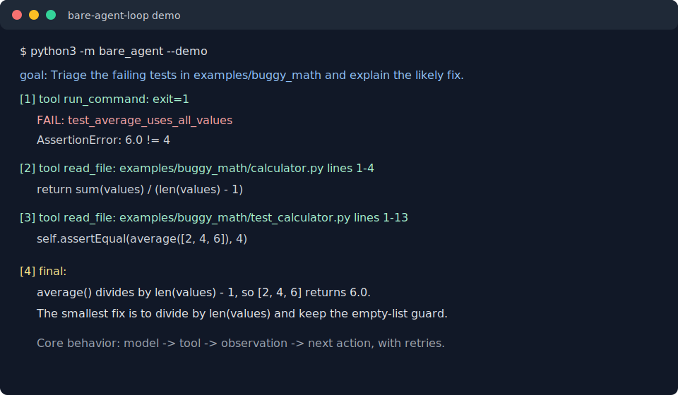

# Bare Agent Loop

[](https://github.com/jaydeepbajwa/bare-agent-loop/actions/workflows/ci.yml)

A framework-free terminal agent that uses a raw OpenAI-compatible chat API, JSON tool calls, working memory, and safe local tools to triage a repo.



*The image above is generated from an actual `--demo` run by
`scripts/render_demo_svg.py`, so it can't drift from what the code does.*

## Quickstart

Needs Python 3.11+ and nothing else — the runtime has zero dependencies.

```bash
git clone https://github.com/jaydeepbajwa/bare-agent-loop.git
cd bare-agent-loop
python3 -m bare_agent --demo
```

The demo is deterministic and does not need an API key. It runs a failing test suite in `examples/buggy_math`, reads the relevant files, and explains the bug. (Run it from a clone — the examples ship with the repo, not the installed package, and the CLI says so if they're missing.)

Optional editable install:

```bash
python3 -m pip install -e .
bare-agent --demo
```

## Real LLM Run

```bash
cp .env.example .env
# edit .env with OPENAI_API_KEY
python3 -m bare_agent --repo . "triage the failing tests and tell me the smallest fix"
```

Use `--allow-write` only when you want the agent to modify files. Without it, the `write_file` tool returns a clear error and the model must adapt.

## How the Loop Works

The whole agent is one loop in [`bare_agent/agent.py`](bare_agent/agent.py), small enough to whiteboard:

1. Build a system prompt from the tool schemas and current working memory
   (rebuilt every step, so facts stored via `remember` are visible on the
   *next* step, not the next run).
2. Ask the model for exactly one JSON action: `{"type": "tool", ...}` or `{"type": "final", ...}`.
3. Execute the tool; append the model's response and the observation to the
   message list. Invalid JSON, unknown tools, and tool failures become
   observations too — the loop never crashes on a bad model turn, it feeds
   the error back and lets the model recover.
4. Stop on a `final` action or after `--max-steps` (default 8), whichever
   comes first.

There is no framework underneath: the model client is one raw
`urllib` request, and everything else is the standard library.

## What It Proves

- Agent loop fundamentals: context, planning, tool schemas, observations, retries, and final answers are explicit Python code.
- No agent framework: runtime code uses the Python standard library plus one raw OpenAI-compatible HTTP request.
- Demo path: a fresh clone can show the loop working in three commands, even without secrets.

## Tool Surface

- `list_files`: bounded file discovery under the workspace.
- `read_file`: bounded text reads with line numbers.
- `run_command`: allowlisted commands run as argv without a shell; failing tests are observations, not crashes.
- `write_file`: workspace-scoped writes, disabled by default.
- `remember`: JSON-backed working memory for durable facts.

## Design Decisions

1. **JSON action protocol over framework calls.** The model returns one object at a time: use a tool or finish. That keeps the agent loop inspectable and easy to whiteboard.
2. **Tool failures become observations.** Invalid JSON, unknown tools, blocked writes, and command failures are fed back into the loop so the next step can recover.
3. **Local safety boundary.** Paths are jailed to the repo root, commands avoid shell strings, and writes require an explicit flag. This is not a sandbox, but it removes the easiest foot-guns.

## Tests

```bash
python3 scripts/lint.py
python3 -m compileall bare_agent examples scripts tests
python3 -m unittest discover -s tests -p "test_*.py"
```

The lint script intentionally stays stdlib-only: it parses Python files and rejects tabs/trailing whitespace. The core invariant under test is recovery behavior: bad model output and tool errors should produce useful next observations rather than crashing the run. The HTTP client's failure modes (auth errors, network failures, unexpected response shapes) are tested against mocked responses — every one must map to an error message that names the setting to check.

## Honest Limits

- This is a learning-sized agent, not a production coding assistant.
- The command tool is allowlisted but still runs on your machine. Use it in repos you trust.
- Context management is simple message accumulation (memory refreshes into the system prompt each step, but nothing is ever summarized or evicted); a larger agent would need summarization and trace storage.
- The OpenAI client targets the chat-completions-style API via raw HTTP. If a provider changes response semantics, the error message points at the model/base URL/key settings to check.

## Writeup

I kept a short build note in [docs/blog-post.md](docs/blog-post.md): what broke, what I would redo, and how this connects to the human-in-the-loop suggestion queue in [care-loop](https://github.com/jaydeepbajwa/care-loop).

## License

MIT
